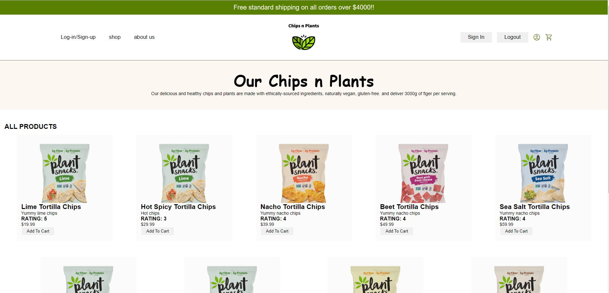
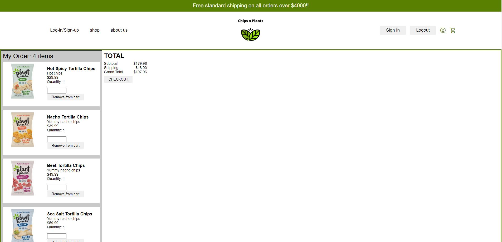

# Chips and Plants E-commerce store

Team members:

- Tanner Davis
- Kenny Johnson
- Ryan Walker
- Kevin Lam

## Technology Stack

### Main Stack

- Database: Postgres
- Server handling: Express
- Frontend: React
- Language: Nodejs

### Additional technologies

- Redux toolkit state management
- JSON Webtoken
- Sequelize
- React-router

## Main Features

- Single page application
- Fetch and view products from a database
- Create a new user and store user data
- Add products to a cart
- Remove products from a cart
- Maintain a persistent cart or logged in status
- Maintain a database of products, orders, users

## Rendered Pages

### Front View

### Cart View

### Sign up View

